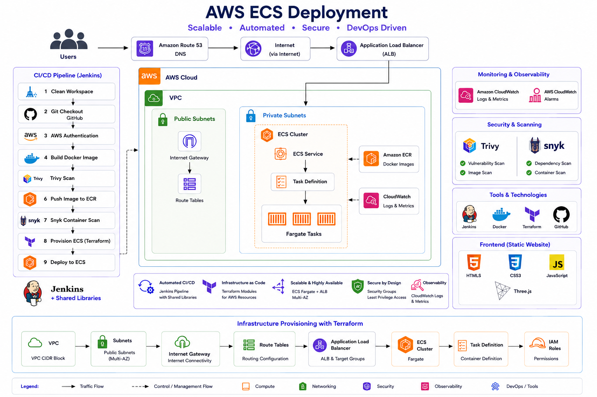

## 📖 Project Overview

This project demonstrates a complete **AWS ECS DevSecOps CI/CD pipeline** that automates the build, security scanning, infrastructure provisioning, and deployment of a containerized web application on **Amazon ECS**.

The solution follows **Infrastructure as Code (IaC)** principles using **Terraform** and implements **DevSecOps** best practices by integrating automated container vulnerability scanning into the CI/CD pipeline.

The **Jenkins pipeline** automatically checks out the source code from GitHub, builds a Docker image, performs security scans using **Trivy** and **Snyk**, pushes the verified image to **Amazon ECR**, provisions or updates AWS infrastructure using **Terraform**, and deploys the latest application version to **Amazon ECS** behind an **Application Load Balancer (ALB)**. This provides a fully automated, repeatable, secure, and production-ready deployment workflow.

The infrastructure is designed to be **modular**, **scalable**, and **reproducible**, provisioning networking components, ECS resources, IAM roles, security groups, Amazon ECR repositories, and load balancing through Terraform. By combining CI/CD automation, container security, and Infrastructure as Code, this project demonstrates how production-grade containerized applications can be deployed consistently on AWS with minimal manual intervention.

---
### 🚀 Key Highlights

- ⚙️ Automated CI/CD pipeline using **Jenkins**
- 🐳 Containerized application with **Docker**
- ☁️ Infrastructure provisioning using **Terraform**
- 📦 Container image storage with **Amazon ECR**
- 🚀 Application deployment on **Amazon ECS**
- 🌐 Load balancing with **Application Load Balancer (ALB)**
- 🔒 Automated container vulnerability scanning using **Trivy**
- 🛡️ Security analysis using **Snyk**
- 🔑 Secure AWS authentication with **IAM Roles & Policies**
- 🔄 End-to-end deployment automation from **code commit to production**
- 📁 Modular Infrastructure as Code (IaC) architecture
- 📈 Production-ready, repeatable deployment workflow

---
## Architecture




---
## 🛠️ Tech Stack

### ☁️ AWS Services

| Service | Purpose |
|----------|---------|
| **Amazon EC2** | Hosts the Jenkins server used for CI/CD automation |
| **Amazon ECS** | Runs the containerized application using ECS Services |
| **Amazon ECR** | Stores and manages Docker container images |
| **Amazon VPC** | Provides isolated networking for the infrastructure |
| **Public & Private Subnets** | Segregates application and infrastructure components |
| **Internet Gateway** | Enables internet connectivity for public resources |
| **Route Tables** | Controls network traffic routing within the VPC |
| **Application Load Balancer (ALB)** | Distributes incoming traffic across ECS tasks |
| **IAM** | Manages secure authentication and authorization for AWS resources |

---
### ⚙️ DevOps & DevSecOps Tools

| Tool | Purpose |
|------|---------|
| **Jenkins** | Continuous Integration and Continuous Deployment (CI/CD) |
| **Jenkins Shared Libraries** | Reusable and standardized pipeline automation |
| **Docker** | Containerizes the application for consistent deployments |
| **Terraform** | Infrastructure as Code (IaC) provisioning |
| **Trivy** | Container image vulnerability scanning |
| **Snyk** | Security analysis and dependency vulnerability scanning |
| **Git & GitHub** | Source code management and version control |

---
### 💻 Programming & Web Technologies

| Technology | Purpose |
|------------|---------|
| **HTML5** | Application frontend structure |
| **CSS3** | Styling and responsive UI |
| **JavaScript** | Client-side application logic |

---
### 🏗️ Architecture Components

- ☁️ Amazon ECS
- 📦 Amazon ECR
- 🖥️ Amazon EC2
- 🌐 Application Load Balancer (ALB)
- 🔐 IAM
- 🌍 Amazon VPC
- 🛣️ Route Tables
- 🔗 Internet Gateway
- 🐳 Docker
- ⚙️ Jenkins
- 📚 Jenkins Shared Libraries
- 🏗️ Terraform
- 🔍 Trivy
- 🛡️ Snyk
- 🐙 GitHub

---
## 🔄 Jenkins Pipeline

The CI/CD pipeline is implemented using **Jenkins Declarative Pipeline** and leverages **Jenkins Shared Libraries** to promote reusable, standardized, and maintainable pipeline code. The pipeline automates the complete application delivery lifecycle—from source code checkout and security validation to infrastructure provisioning and deployment on **Amazon ECS**.

### 📌 Pipeline Highlights
- Uses **Jenkins Shared Libraries** (`@Library('my-shared-lib') _`) for reusable CI/CD functions.
- Centralized environment variables for improved maintainability and consistency.
- Automatically authenticates with AWS using Jenkins credentials.
- Builds and tags Docker images for deployment.
- Performs container vulnerability scanning with **Trivy**.
- Pushes validated container images to **Amazon ECR**.
- Executes an additional container security assessment using **Snyk**.
- Provisions or updates AWS infrastructure using **Terraform**.
- Deploys the latest application version to **Amazon ECS**.
- Provides a fully automated, secure, and repeatable deployment workflow.

---
### 🌍 Environment Variables

| Variable | Description |
|----------|-------------|
| `IMAGE_NAME` | Docker image repository name |
| `IMAGE_TAG` | Docker image version/tag used for deployment |
| `TF_DIR` | Terraform working directory |
| `AWS_CREDENTIALS_ID` | Jenkins AWS credentials used for authentication |

---
### 🚀 Pipeline Stages

| Stage | Description |
|--------|-------------|
| **1. Clean Workspace** | Removes files from previous builds to ensure a clean execution environment. |
| **2. Git Checkout** | Retrieves the latest source code from the GitHub repository. |
| **3. AWS Authentication** | Authenticates with AWS using securely stored Jenkins credentials. |
| **4. Build Docker Image** | Builds the application into a Docker container image. |
| **5. Trivy Security Scan** | Scans the Docker image for operating system and application vulnerabilities. |
| **6. Push Image to Amazon ECR** | Pushes the verified Docker image to Amazon Elastic Container Registry. |
| **7. Snyk Container Scan** | Performs an additional security scan for known vulnerabilities and best practices. |
| **8. Terraform Provisioning** | Creates or updates AWS infrastructure required for the ECS application. |
| **9. Deploy to Amazon ECS** | Updates the ECS service with the latest container image and deploys the application. |

---
### 🔁 Pipeline Workflow

```text
GitHub Repository
        │
        ▼
Jenkins Pipeline
        │
        ├── Clean Workspace
        ├── Git Checkout
        ├── AWS Authentication
        ├── Build Docker Image
        ├── Trivy Scan
        ├── Push Image to Amazon ECR
        ├── Snyk Container Scan
        ├── Terraform Provisioning
        └── Deploy to Amazon ECS
                 │
                 ▼
        Application Load Balancer
                 │
                 ▼
              End Users
```

---

### Security

- Container vulnerability scanning using **Trivy** and **Snyk**

---

### Contributing

Contributions to this **festive DevOps project** are welcome! You can help improve the project by enhancing CI/CD, security, or documentation.

---
### Areas to Contribute
- Add **new CI/CD pipeline stages** or improve existing Jenkins shared library functions.
- Integrate additional **container security scans** (e.g., trivy, snyk).
- Extend **monitoring dashboards** for ECS, ALB, Docker, or application metrics.
- Optimize **Terraform modules** for reusability and efficiency.

💡 **Tip:** Keep the focus on **automation, DevOps best practices, and containerized deployments**, while maintaining the festive spirit of the Diwali website.

---
### License

- This project is licensed under the **MIT License** – feel free to use, adapt, or extend it for   
  your organization or personal learning.
---
